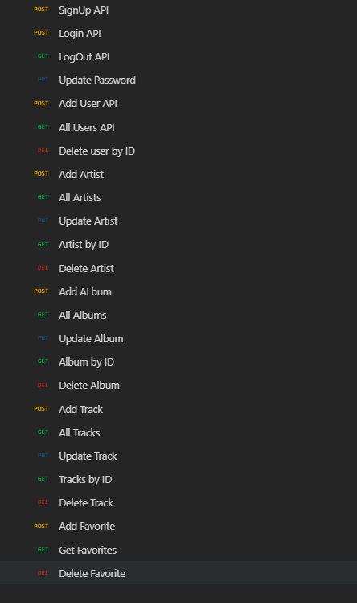

## Enhanced Music Library Management API

This is a backend application developed for the Voosh backend developer assignment. I have developed a Music Library Management API that allows users within an organization to manage their collection of Artists, Tracks, and Albums.

**Important Files Overview**
### **Core Files**  
- **server.js**: Entry point for the application, initializing the server and connecting to the database.  
- **package.json**: Contains project metadata and lists dependencies and scripts.

---

### **Configuration & Database**  
- **connectDB.js**: Establishes a connection to the MongoDB database using Mongoose.  
- **.env**: Stores sensitive environment variables like database URIs and authentication secrets (not pushed to GitHub).

---

### **Controllers**  
Handles API logic and manages CRUD operations:  
- **AdminController.js**: Manages administrative tasks.  
- **AlbumController.js**: Handles album-related CRUD operations.  
- **ArtistController.js**: Manages artist-related actions.  
- **FavoriteController.js**: Manages user favorites for quick access.  
- **TrackController.js**: Handles track-related operations.

---

### **Models**  
Defines the database schemas using Mongoose:  
- **User.js**: Defines user roles and authentication details.  
- **Artist.js**: Stores artist information and visibility status.  
- **Album.js**: Tracks album data and its association with artists.  
- **Track.js**: Manages track details and album relationships.  
- **Favorite.js**: Tracks user favorites by category and item ID.

---

### **Routes**  
Defines API endpoints and middleware integration:  
- **AdminRoutes.js**: Routes for admin-specific operations.  
- **AlbumRoutes.js**: CRUD routes for albums.  
- **ArtistRoutes.js**: CRUD routes for artists.  
- **FavoriteRoutes.js**: Routes for managing favorites.  
- **TrackRoutes.js**: CRUD routes for tracks.  
- **UserRoutes.js**: Handles user registration and authentication.

---

### **Middlewares**  
- **Middleware.js**: Contains custom middleware functions like authentication and error handling.

---

### **Utilities**  
Helper functions and custom error management:  
- **ErrorHandler.js**: Defines custom error classes and error-handling utilities.  
- **RecordUtils.js**: Provides reusable functions for retrieving and managing database records.

---

**Dependencies:**
| Package       | Version   | Use                          |
|---------------|-----------|------------------------------|
| nodejs        | v23.0.0   | JS Runtime Environment       |
| bcryptjs      | v2.4.3    | To hash the password         |
| cors          | v2.8.5    | To handle CORS               |
| dotenv        | v16.4.7   | To handle secrets            |
| express       | v4.21.2   | To handle routing            |
| jsonwebtoken  | v9.0.2    | To handle auth with tokens   |
| mongodb       | v6.12.0   | Database                     |
| mongoose      | v8.8.4    | Object Data Modeling         |
| uuid          | v11.0.3   | To create unique IDs         |

---

#### **Features**

### **Organization Management**  
- **Admin**: Each organization has a single Admin with full control over the system.  

### **Role-Based Access Control**  
- **Admin**: Complete system access with all CRUD permissions.  
- **Editor**: Permissions to add, update, or delete artists, albums, and tracks.  
- **Viewer**: Read-only access to artists, albums, and tracks, with full CRUD rights on favorites.  

### **Entity Relationships**  
- **Albums**: Albums belong to specific artists.  
- **Tracks**: Tracks are associated with both albums and artists.  

### **Favorites**  
- Users can personalize their experience by marking items as favorites for quick and easy retrieval.

---
#### API Endpoints:

